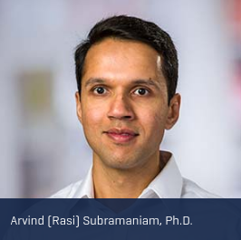
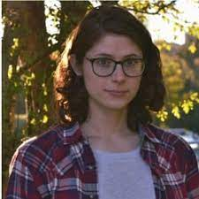
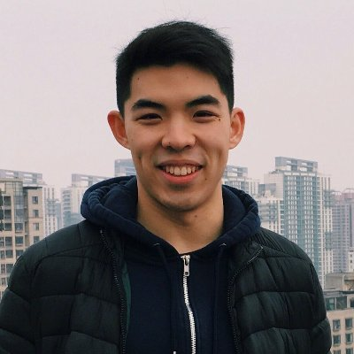
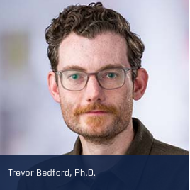
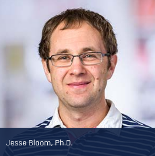
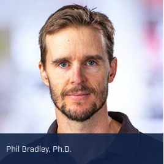
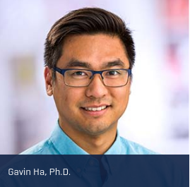
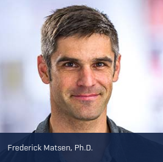

# MCB 536 

# Tools for Computational Biology

---

## Today's objectives

- Locate information relevant to the course (lecture materials, assessment, communication streams)
- Identify range of skills and concepts covered in this course
- Learn basics of VSCode, Git, Markdown

---

## Zoom logistics

- Same Zoom link for duration of class 
- Separate Zoom link for TA office hours 

Zoom link pinned on #lectures-homework Slack channel

 

#### Etiquette

- Stay muted
- Highly encouraged: Unmute yourself and ask questions at any point
- Use Slack for detailed questions (next slide)

---

## Communication

Slack Workspace: TFCB2021

- #general: course announcements (please turn on notifications for this channel)
- #lectures-homework: questions about course content and help for homework
- see pinned posts in each channel for quick links and reminders

---

## Today's instructor

- Rasi Subramaniam
- Associate Professor in Basic Sciences & Computational Biology @FredHutch
- Research Area: mRNA Translation

---

## Teaching assistants & office hours

| | 
|-|-
|  | 
| Ty Bottorff | Timothy Yu
| Mon 1-2PM | Wed 1-2 PM

---

## Other instructors

 

Herbold Computational Biology Program  
Fred Hutch

---

## Introduce yourself!

- Name (including preferred form of address)
- Research interests (type of data, model organism, research questions, etc)

---

## Course objectives

By the end of the course, you should be able to:

- Use VSCode to program in R, Python, and Unix/bash shell using appropriate syntax and code convention

- Apply good practices for computational research including project and data organization

- Select appropriate tools to perform specific programming and data analysis tasks

- Analyze common forms of data generated by molecular biology experiments including flow cytometry, 96-well plate readers, and high throughput sequencing.

---

## What you won't be able to do

- Use ALL of the computational tools your research will require

- Know the best algorithm or analysis method for a specific research question

- Code with expert-level skills

... but you should be equipped to work towards these goals on your own.

<!-- 
- Learn outside class. You will get most benefit if you spend time studying on your own on the internet.
- Learning curve will be steep. Your ability to do things will be limited for a while. This is quite normal.
- You are really learning a new language and also a new way of thinking about problems and solving them. So it will take time to get comfortable.
- Think of this class as a rapid tour through Africa or Europe or South America where everyone speaks a different language than you. You can appreciate what is there, but to be comfortable or get really good, you need to spend lot of time immersed in that culture. 
-->

---

## Course website

Syllabus, lectures, homeworks

Rendered materials (prettier/easier to view):  
https://fredhutch.github.io/tfcb_2021/

Original GitHub repository:
https://github.com/fredhutch/tfcb_2021

---

## Homeworks

Submit through <a href="http://canvas.uw.edu/">Canvas</a>   
MCB 536 A Au 21     
Tools For Computational Biology

Eight assignments (10% each) + [participation](participation_rubric.md) (20%)

---

## Play time

- GitHub
- VSCode
- Markdown

<!-- 

Demo outline

GitHub
- Create new Github project
- Fork GitHub Project
- Clone from GitHub

VScode
- Interface: File explorer, command line, git, extensions
- Git add, commit, push, pull

Markdown
- Cover syntax https://guides.github.com/features/mastering-markdown/
- Live Preview in VSCode 

-->

---

## Helpful resources

- [VSCode Intro Video Series](https://code.visualstudio.com/docs/getstarted/introvideos)
- [Crash Course on Git and GitHub Video](https://www.youtube.com/watch?v=RGOj5yH7evk)
- [Markdown Syntax Guide](https://guides.github.com/features/mastering-markdown/)

---

## Before next class

- Compete the pre-class survey
- Install all required [software](../../software/README.md)
- Ensure your paperwork has been submitted to the Hutch so you can obtain a HutchNetID!