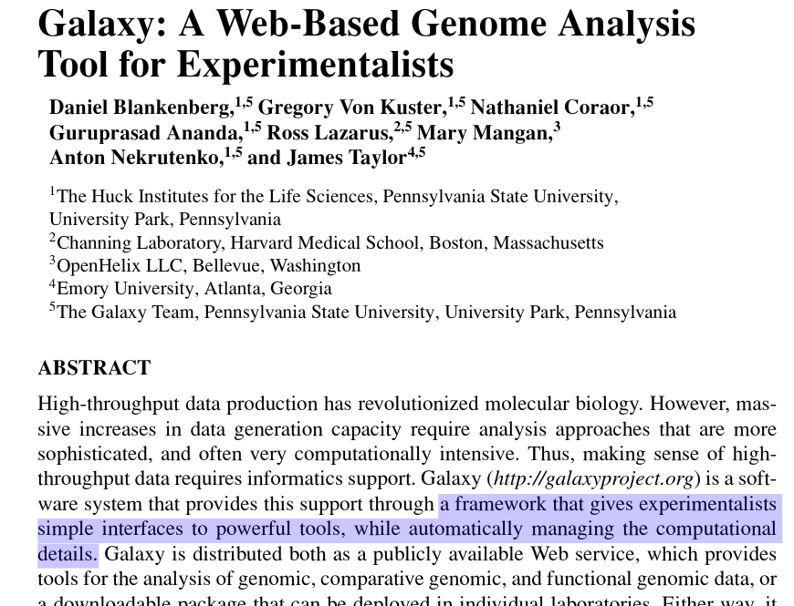

#

**_teaching goals_**

 

* what is high performance computing
* rudiments of command line interaction
* how to run a command in parallel across cores

# eventually you will outgrow your laptop

#

#
<section data-background="https://img-en.fs.com/community/wp-content/uploads/2016/08/Data-Center-.jpg"></section>

#
<section data-background="images/gizmo.png"></section>

#

#

#

# linux = do whatever you want on high-performance compute systems

#
<section data-background="https://upload.wikimedia.org/wikipedia/commons/thumb/2/27/Wikimedia_Foundation_Servers-8055_08.jpg/1280px-Wikimedia_Foundation_Servers-8055_08.jpg"></section>

#
<section data-background="images/datacenter-cooling.jpg"></section>

#
<section data-background="https://upload.wikimedia.org/wikipedia/commons/thumb/3/38/Inside_and_Rear_of_Webserver.jpg/1920px-Inside_and_Rear_of_Webserver.jpg"></section>

#
<section data-background="images/processor.jpg"></section>

#
<section data-background="images/tractor.jpg"></section>

#
<section data-background="images/harvesters.jpg"></section>

#
<section data-background="https://upload.wikimedia.org/wikipedia/commons/c/c7/HuaweiRH2288HV2.JPG"></section>

# the command line is the computational lab bench

#

#

the command line is the "native" environment   for interacting with linux

 

similar environments also appear   on Mac OS and Windows

#

_buy eggs_

    buy eggs

 

_buy two dozen eggs_

    buy --dozens 2 eggs

 

_buy, using cash, two dozen eggs_

    buy --using cash --dozens 2 eggs

#

_buy eggs and fry them_

    buy eggs | fryingpan --oiled --minutes 4

 

_buy eggs, fry them, and store on plate_

    buy eggs | fryingpan --oiled --minutes 4 > plate

#

You can write a little program  
to execute command line calls.

This is called a "shell script".

 

    buy eggs | hands --action crack > bowl

    whisk --input bowl | fryingpan --oiled --minutes 4 > plate

#

but first, let's mash the keyboard

#

    buy eggs | hands --action crack > bowl
    whisk --input bowl | fryingpan --oiled --minutes 4 > plate

 

    samtools view wgs_bam_NA12878_20k_b37_NA12878.bam \
                   | cut -f3 | sort | uniq -c > contig_counts.txt
    sort -n -r contig_counts.txt > contig_counts_sorted.txt
    head contig_counts_sorted.txt

#
**When to use shell programming?**

 

Just you are _only_ running other commands, like making a simple computational pipeline.

For other tasks, use Python or R.

For a serious computational pipeline, consider a tool such as [Snakemake](https://snakemake.readthedocs.io/en/stable/) or [Nextflow](https://www.nextflow.io/).

#

These slides were generated from source 
using a [shell script](https://github.com/FredHutch/tfcb_2021/blob/main/lectures/lecture03/slides/build.sh).

#

**Unix philosophy**

* Write programs that do one thing and do it well.
* Write programs to work together.
* Write programs to handle text streams, because that is a universal interface.

#

**May you be a happy and free ferret**

 

