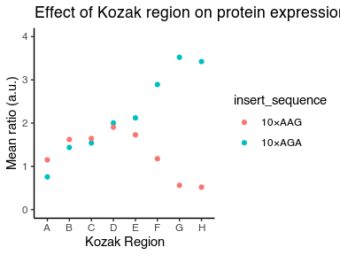

test\_functions
================
Rasi Subramaniam
11/9/2021

## Load packages

``` r
library(tidyverse)
```

    ## ── Attaching packages ─────────────────────────────────── tidyverse 1.3.0 ──

    ## ✓ ggplot2 3.3.2     ✓ purrr   0.3.4
    ## ✓ tibble  3.0.3     ✓ dplyr   1.0.2
    ## ✓ tidyr   1.1.2     ✓ stringr 1.4.0
    ## ✓ readr   1.3.1     ✓ forcats 0.5.0

    ## ── Conflicts ────────────────────────────────────── tidyverse_conflicts() ──
    ## x dplyr::filter() masks stats::filter()
    ## x dplyr::lag()    masks stats::lag()

``` r
data <- read_tsv("data/example_dataset_1.tsv") %>% 
  print()
```

    ## Parsed with column specification:
    ## cols(
    ##   strain = col_character(),
    ##   mean_yfp = col_double(),
    ##   mean_rfp = col_double(),
    ##   mean_ratio = col_double(),
    ##   se_ratio = col_double(),
    ##   insert_sequence = col_character(),
    ##   kozak_region = col_character()
    ## )

    ## # A tibble: 16 x 7
    ##    strain  mean_yfp mean_rfp mean_ratio se_ratio insert_sequence kozak_region
    ##    <chr>      <dbl>    <dbl>      <dbl>    <dbl> <chr>           <chr>       
    ##  1 schp688     1748    20754      0.755    0.066 10×AGA          A           
    ##  2 schp684     3294    20585      1.44     0.021 10×AGA          B           
    ##  3 schp690     3535    20593      1.54     0.018 10×AGA          C           
    ##  4 schp687     4658    20860      2.00     0.021 10×AGA          D           
    ##  5 schp686     5000    21171      2.12     0.023 10×AGA          E           
    ##  6 schp685     7379    22956      2.89     0.05  10×AGA          F           
    ##  7 schp683     9365    23866      3.52     0.11  10×AGA          G           
    ##  8 schp689     8693    22649      3.42     0.125 10×AGA          H           
    ##  9 schp679     2528    19906      1.15     0.056 10×AAG          A           
    ## 10 schp675     3687    20438      1.62     0.036 10×AAG          B           
    ## 11 schp681     3705    20227      1.64     0.021 10×AAG          C           
    ## 12 schp678     4378    20630      1.91     0.01  10×AAG          D           
    ## 13 schp677     3967    20604      1.73     0.03  10×AAG          E           
    ## 14 schp676     2657    20223      1.18     0.048 10×AAG          F           
    ## 15 schp674     1270    20316      0.561    0.004 10×AAG          G           
    ## 16 schp680     1117    19377      0.519    0.01  10×AAG          H

``` r
ggplot(data, aes(x = kozak_region, y = mean_ratio, color = insert_sequence)) +
  geom_point() +
  theme_classic() +
  scale_y_continuous(limits = c(0,4)) +
  labs(x = "Kozak Region", y = "Mean ratio (a.u.)", title = "Effect of Kozak region on protein expression")
```

<!-- -->

``` r
ggsave("figures/example_plot.pdf")
```

    ## Saving 4 x 3 in image
