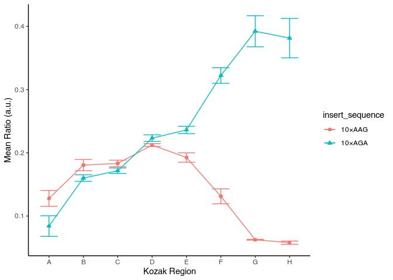
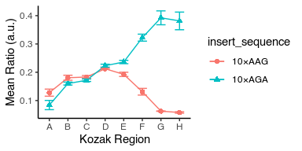
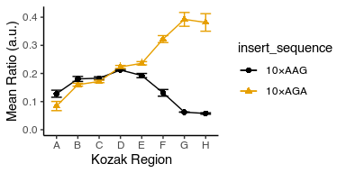
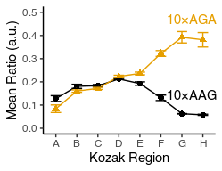

Lecture 14: In-class exercises
================
PUT YOUR NAME HERE
11/12/2020

# Load packages you need

``` r
library(tidyverse)
```

    ## ── Attaching packages ─────────────────────────────────────── tidyverse 1.3.0 ──

    ## ✓ ggplot2 3.3.2     ✓ purrr   0.3.4
    ## ✓ tibble  3.0.3     ✓ dplyr   1.0.2
    ## ✓ tidyr   1.1.2     ✓ stringr 1.4.0
    ## ✓ readr   1.3.1     ✓ forcats 0.5.0

    ## ── Conflicts ────────────────────────────────────────── tidyverse_conflicts() ──
    ## x dplyr::filter() masks stats::filter()
    ## x dplyr::lag()    masks stats::lag()

# Read in example dataset 5 in the `data` subfolder and store the result in `flow_data` variable

Note that the first line is a comment that mentions the column names.
This annoying structure is typical of datasets that you might receive
from someone else. Look at the documentation of `read_csv` and figure
out how to skip commented out lines and assign your own column
names.

``` r
flow_data <- read_csv("data/example_dataset_5.csv", col_names = c("strain", "yfp", "rfp", "replicate"), comment = "#") %>% 
  print()
```

    ## Parsed with column specification:
    ## cols(
    ##   strain = col_character(),
    ##   yfp = col_double(),
    ##   rfp = col_double(),
    ##   replicate = col_double()
    ## )

    ## # A tibble: 74 x 4
    ##    strain    yfp   rfp replicate
    ##    <chr>   <dbl> <dbl>     <dbl>
    ##  1 schp677  4123 20661         1
    ##  2 schp678  4550 21437         1
    ##  3 schp675  3880 21323         1
    ##  4 schp676  2863 20668         1
    ##  5 schp687  4767 20995         1
    ##  6 schp688  1274 20927         1
    ##  7 schp679  2605 20840         1
    ##  8 schp680  1175 20902         1
    ##  9 schp681  3861 20659         1
    ## 10 schp683  9949 25406         1
    ## # … with 64 more rows

# Read in example dataset 3 in the `data` subfolder which contains the annotations for the above table and store it in a variable `annotations`

``` r
annotations <- read_tsv("data/example_dataset_3.tsv") %>% 
  print()
```

    ## Parsed with column specification:
    ## cols(
    ##   strain = col_character(),
    ##   insert_sequence = col_character(),
    ##   kozak_region = col_character()
    ## )

    ## # A tibble: 17 x 3
    ##    strain  insert_sequence kozak_region
    ##    <chr>   <chr>           <chr>       
    ##  1 schp674 10×AAG          G           
    ##  2 schp675 10×AAG          B           
    ##  3 schp676 10×AAG          F           
    ##  4 schp677 10×AAG          E           
    ##  5 schp678 10×AAG          D           
    ##  6 schp679 10×AAG          A           
    ##  7 schp680 10×AAG          H           
    ##  8 schp681 10×AAG          C           
    ##  9 schp683 10×AGA          G           
    ## 10 schp684 10×AGA          B           
    ## 11 schp685 10×AGA          F           
    ## 12 schp686 10×AGA          E           
    ## 13 schp687 10×AGA          D           
    ## 14 schp688 10×AGA          A           
    ## 15 schp689 10×AGA          H           
    ## 16 schp690 10×AGA          C           
    ## 17 control <NA>            <NA>

# Join the two tables above and assign to a new variable `data`

``` r
data <- inner_join(flow_data, annotations, by = "strain") %>% 
  print()
```

    ## # A tibble: 74 x 6
    ##    strain    yfp   rfp replicate insert_sequence kozak_region
    ##    <chr>   <dbl> <dbl>     <dbl> <chr>           <chr>       
    ##  1 schp677  4123 20661         1 10×AAG          E           
    ##  2 schp678  4550 21437         1 10×AAG          D           
    ##  3 schp675  3880 21323         1 10×AAG          B           
    ##  4 schp676  2863 20668         1 10×AAG          F           
    ##  5 schp687  4767 20995         1 10×AGA          D           
    ##  6 schp688  1274 20927         1 10×AGA          A           
    ##  7 schp679  2605 20840         1 10×AAG          A           
    ##  8 schp680  1175 20902         1 10×AAG          H           
    ##  9 schp681  3861 20659         1 10×AAG          C           
    ## 10 schp683  9949 25406         1 10×AGA          G           
    ## # … with 64 more rows

# Create a new column `ratio` containing ratio of YFP and RFP signals for each strain replicate.

Store the result in the same `data` variable.

``` r
data <- data %>% 
  mutate(ratio = yfp / rfp) %>% 
  print()
```

    ## # A tibble: 74 x 7
    ##    strain    yfp   rfp replicate insert_sequence kozak_region  ratio
    ##    <chr>   <dbl> <dbl>     <dbl> <chr>           <chr>         <dbl>
    ##  1 schp677  4123 20661         1 10×AAG          E            0.200 
    ##  2 schp678  4550 21437         1 10×AAG          D            0.212 
    ##  3 schp675  3880 21323         1 10×AAG          B            0.182 
    ##  4 schp676  2863 20668         1 10×AAG          F            0.139 
    ##  5 schp687  4767 20995         1 10×AGA          D            0.227 
    ##  6 schp688  1274 20927         1 10×AGA          A            0.0609
    ##  7 schp679  2605 20840         1 10×AAG          A            0.125 
    ##  8 schp680  1175 20902         1 10×AAG          H            0.0562
    ##  9 schp681  3861 20659         1 10×AAG          C            0.187 
    ## 10 schp683  9949 25406         1 10×AGA          G            0.392 
    ## # … with 64 more rows

# Calculate the mean and standard deviation of the YFP-RFP ratio across all replicates for each strain.

To do the above, create new summary columns `mean_ratio` and `std_ratio`
after grouping all replicates.

Assign the result to `avg_data` variable.

``` r
avg_data <- data %>% 
  group_by(strain) %>%
  summarize(mean_ratio = mean(ratio), std_ratio = sd(ratio)) %>%
  print()
```

    ## `summarise()` ungrouping output (override with `.groups` argument)

    ## # A tibble: 16 x 3
    ##    strain  mean_ratio std_ratio
    ##    <chr>        <dbl>     <dbl>
    ##  1 schp674     0.0625  0.000640
    ##  2 schp675     0.181   0.00887 
    ##  3 schp676     0.131   0.0118  
    ##  4 schp677     0.193   0.00747 
    ##  5 schp678     0.212   0.00223 
    ##  6 schp679     0.128   0.0125  
    ##  7 schp680     0.0578  0.00256 
    ##  8 schp681     0.183   0.00520 
    ##  9 schp683     0.392   0.0246  
    ## 10 schp684     0.160   0.00517 
    ## 11 schp685     0.322   0.0124  
    ## 12 schp686     0.236   0.00584 
    ## 13 schp687     0.223   0.00523 
    ## 14 schp688     0.0841  0.0163  
    ## 15 schp689     0.381   0.0311  
    ## 16 schp690     0.172   0.00442

# What happened to the annotations? Can you join them back with `avg_data`?

``` r
avg_data <- inner_join(avg_data, annotations, by = "strain") %>% 
  print()
```

    ## # A tibble: 16 x 5
    ##    strain  mean_ratio std_ratio insert_sequence kozak_region
    ##    <chr>        <dbl>     <dbl> <chr>           <chr>       
    ##  1 schp674     0.0625  0.000640 10×AAG          G           
    ##  2 schp675     0.181   0.00887  10×AAG          B           
    ##  3 schp676     0.131   0.0118   10×AAG          F           
    ##  4 schp677     0.193   0.00747  10×AAG          E           
    ##  5 schp678     0.212   0.00223  10×AAG          D           
    ##  6 schp679     0.128   0.0125   10×AAG          A           
    ##  7 schp680     0.0578  0.00256  10×AAG          H           
    ##  8 schp681     0.183   0.00520  10×AAG          C           
    ##  9 schp683     0.392   0.0246   10×AGA          G           
    ## 10 schp684     0.160   0.00517  10×AGA          B           
    ## 11 schp685     0.322   0.0124   10×AGA          F           
    ## 12 schp686     0.236   0.00584  10×AGA          E           
    ## 13 schp687     0.223   0.00523  10×AGA          D           
    ## 14 schp688     0.0841  0.0163   10×AGA          A           
    ## 15 schp689     0.381   0.0311   10×AGA          H           
    ## 16 schp690     0.172   0.00442  10×AGA          C

# Plot the mean and standard deviation of the YFP-RFP ratio as a function of the Kozak region.

Display the result as a point graph and a line graph with error bars
around the mean.

Give the insert\_sequences different shapes and colors.

Can you make the markers twice their default size?

Can you make the error bars half as wide as their default width?

Store the result as a PDF file named `demo_plot.pdf` in `figures`
subfolder.

``` r
avg_data %>%
ggplot(aes(x = kozak_region, y = mean_ratio, color = insert_sequence, shape = insert_sequence, group = insert_sequence)) +
  geom_point(size = 2) +
  geom_line() +
  geom_errorbar(aes(ymin = mean_ratio - std_ratio, ymax = mean_ratio  + std_ratio), width = 0.5)
```

<!-- -->

``` r
ggsave("figures/example_plot.pdf")
```

    ## Saving 4 x 3 in image

# We start from where we left off last week in Lecture 13

# Modify the above plot to change X-axis label to “Kozak Region” and Y-axis label to “Mean Ratio (a.u.)”

<!-- -->

# Find and use another standard `ggplot2` theme that converts the grey backgound to white and without grids

<!-- -->

# Adjust figure size to have `proportional ink`

<!-- -->

# Adjust the bottom of Y-scale to start from zero

<!-- -->

# Change colors to be color-blind friendly

You have two options:

1.  Install the `ggthemes` package and use the `scale_color_colorblind`
    function from there.
2.  Set the color manually to one of the hex colors in `c("#999999",
    "#E69F00", "#56B4E9", "#009E73", "#F0E442", "#0072B2", "#D55E00",
    "#CC79A7")`.

<!-- -->

# Notice that the legend is in the opposite order to the plot lines. Can you change their order to match?

Hint: use `mutate` with `fct_reorder` and `.desc = TRUE` to modify the
`insert_sequence` column before feeding it to
`ggplot`.

<!-- -->

# Can you remove the legend altogether before we proceed to the next step?

<!-- -->

# Put the `insert_sequence` label physically close to each line.

Hint: Use `geom_text` with `label` aesthetic and the `data` argument
modified to include only the one data point for each `insert_sequence`
from `avg_data` and placing it.

Note that you will have to adjust `mean_ratio` so that the text is not
on top of your data.

Note that you can play with `hjust` argument of `geom_text` to tweak
horizontal placement.

Adjust the plot dimensions so that it looks ‘nice’.

<!-- -->
